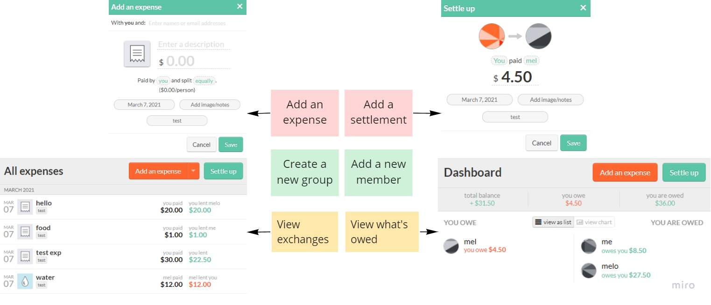

# Debt Tracking Application in C
 
The goal for our project was to create a debt tracker program that allows users to track their expenses within a group over time. Our intention with making this program is for student groups to be able to keep track of how much money each person owes or is owed by each of the other group members. A debt tracker is something that is something useful that we would use within our suite, and we can imagine it being useful to other people who need to keep track of monetary exchanges. Our MVP is a working program that will be able to keep track of debt and manage certain users through a local terminal, and our ideal final product is to have an application that incorporates a friendlier UI.
 
The learning goal we set out to achieve by working on this project was to develop a better understanding of program development in C. We specifically wanted to learn about how to manage data flow and how to store data in a way that can be accessed and manipulated in an application built in C.
 
To get started, we looked at existing software that performs the same task of debt tracking, namely, Splitwise. This helped us choose which features we wanted to include in our program. We decided to further define our MVP as being a program that carries out these six basic functions:
<p align="center">

<p/>
The first and main design decision we made for our application was to store our data in the form of a plain text file. This was a straightforward way to keep data in a place that we could access and modify. Based on the program features we decided on, we found that the data flow required to carry them out could be achieved by simply performing file operations such reading and writing. We intended to build our application using this data format and, in case we wanted to expand the scope of our project, be open to researching more specific database systems. We were able to successfully build our MVP, and decided to stick with files as a data storage format as we expanded our project to develop a better user interface using GTK. Although we weren’t able to develop a complete GUI for our entire program, we used GTK to implement it for a few of the features.
 
When debugging and figuring out how to approach certain hurdles in our project, we used websites such as Stack Overflow, CodeForWin, and watched YouTube tutorial videos on the things we were trying to implement. The ZetCode written tutorial was particularly useful for understanding how to use the GTK library to create a graphical user interface for our application. It introduces the basics of GUI programming and layout management.
 
Our final project is a command line program that has the six main features we planned to include. When we run our program, it prompts the user with a list of functions to choose from:


[input file](../CSV/input.c)
[action file](../CSV/action.c)
[main file](../CSV/main.c)


```
while (fgets(line, MAXLINE, fp)) {
    column = 0;
    strcpy(buffer, line);
    char* value = strtok(buffer, " \n");
    while (value) {
        if (column == c && row == r) {
            int num = atoi(value);
            num += change;
            fprintf(new_fp, "%d ", num);
        }
        else if (column == r && row == c) {
            int num = atoi(value);
            num -= change;
            fprintf(new_fp, "%d ", num);
        }
        else (fprintf(new_fp,"%s ", value));
        value = strtok(NULL, " \n");
        column++;
    }
    fprintf(new_fp,"\n");
    row++;
}
```

