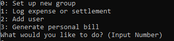
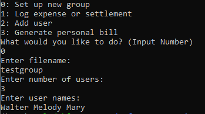
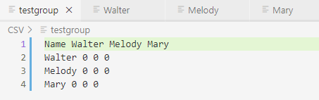
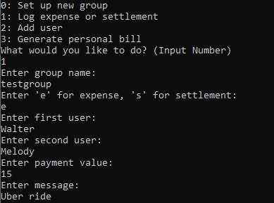
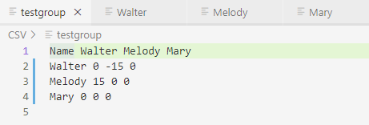
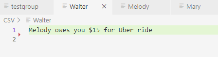
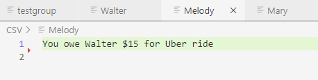
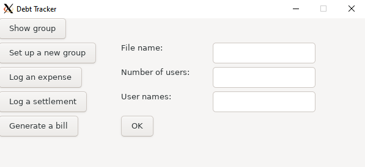

# Debt Tracking Application in C
## Team Members: Melody Chiu and Walter Villa
 
The goal for our project was to create a debt tracker program that allows users to track their expenses within a group over time. Our intention with making this program is for student groups to be able to keep track of how much money each person owes or is owed by each of the other group members. A debt tracker is something that is something useful that we would use within our suite, and we can imagine it being useful to other people who need to keep track of monetary exchanges. Our MVP is a working program that will be able to keep track of debt and manage certain users through a local terminal, and our ideal final product is to have an application that incorporates a friendlier UI.
 
The learning goal we set out to achieve by working on this project was to develop a better understanding of program development in C. We specifically wanted to learn about how to manage data flow and how to store data in a way that can be accessed and manipulated in an application built in C.
 
To get started, we looked at existing software that performs the same task of debt tracking, namely, Splitwise. This helped us choose which features we wanted to include in our program. We decided to further define our MVP as being a program that carries out these six basic functions:

<p align="center">

<p/>

The first and main design decision we made for our application was to store our data in the form of a plain text file. This was a straightforward way to keep data in a place that we could access and modify. Based on the program features we decided on, we found that the data flow required to carry them out could be achieved by simply performing file operations such reading and writing. We intended to build our application using this data format and, in case we wanted to expand the scope of our project, be open to researching more specific database systems. We were able to successfully build our MVP, and decided to stick with files as a data storage format as we expanded our project to develop a better user interface using GTK. Although we weren’t able to develop a complete GUI for our entire program, we used GTK to implement it for a few of the features.
 
When debugging and figuring out how to approach certain hurdles in our project, we used websites such as Stack Overflow, CodeForWin, and watched YouTube tutorial videos on the things we were trying to implement. The ZetCode written tutorial was particularly useful for understanding how to use the GTK library to create a graphical user interface for our application. It introduces the basics of GUI programming and layout management.
 
Our final project is a command line program that has the six main features we planned to include. When we run our program, it prompts the user with a list of functions to choose from:

<p align="center">

 <p/>
 
This is a representation of our program’s [main menu](../CSV/main.c). From here, the user chooses a function to perform by entering a number linked to a specific task. This is a simple switch case that calls on the function associated with the chosen task.

<p align="center">
 
<p/>

To illustrate how our program works, we’ll walk through an example in which the user sets up a new group. The user enters ‘0’ into the command line which triggers a function that gathers information from the user needed to set up a new group. In this case, the user enters a file name to host the group data, the number of users that will be in the group, and their names. With this information, the program creates a plain text file to store group information as a table and an empty text file for each of the users.

<p align="center">
 
<p/>

Now that we have a file to contain group information, this serves as the central database of our program. Looking at this file allows us to track the users within the group, in terms of how much money they owe each other. As transactions are made, the values in this file are updated accordingly. We structured the contents of this file to be read as a table, so that a users column represents how much money they are owed and their row represents how much money they owe others. At any point on the table, the row user owes the column user that sum of money. This way, the implementation of our other program features involve simple file operations to manipulate and read data from this group file.

<p align="center">

<p/>

For example, logging a transaction between two people can be reflected in the data by changing the values at the corresponding indexes. To log a transaction where Walter paid $15 for Melody's Uber ride, the values in the main file are updated. The function will also update personal bill files so users are able to specify the cost and reason for a payment to have taken place, and keep a receipt of past transactions.

<p align="center">

<p/>

The code snippet below, from the [action file](../CSV/action.c), shows how values from the group file can be manipulated. Here, the original group file is opened to be read and a new group file that represents the updated values is opened to be written into. Strtok is used to traverse the table value by value, and the value at the right row and column index is changed to reflect a transaction having been made before being added to the updated group file. 
```
char* value = strtok(buffer, " \n");
while (value) {
    if (column == c && row == r) {
        int num = atoi(value);
        num += change;
        fprintf(new_fp, "%d ", num);
    }
    else if (column == r && row == c) {
        int num = atoi(value);
        num -= change;
        fprintf(new_fp, "%d ", num);
    }
    else (fprintf(new_fp,"%s ", value));
    value = strtok(NULL, " \n");
    column++;
}
```
For our program architecture, we organized our code into three functional areas: [main](../CSV/main.c), [input file](../CSV/input.c) and [action](../CSV/action.c). The main file defines our main menu, while the input file stores functions that prompt the user for information needed for certain tasks, and the action file uses that information to carry out those tasks, working directly with the database. With this type of structure, each feature has an associated input and action function, which is apparent in the following snippet of our [header file](../CSV/main.h). This kind of code structure allowed us to easily follow and find errors in our dataflow.

```
// "Set up a new group" functions
void new_group_input();
void new_group_action(char* filename, char* names[], int num_of_users);

// "Log expense or settlement" functions
void log_input();
void log_action(char* file, int c, int r, int change);
```

To improve our user interface, we explored the GTK toolkit. This allowed us to create a window and buttons for the user to interact with, as opposed to typing into the terminal command line. With time, we could easily develop our [GTK application](../GTK/gtkapp.c) to include all of our program features. Currently, the program is able to create a main menu window with buttons on the left hand side that allow the user to pick a function to perform. This window shows a user creating a new group using the GTK program, which has a much friendlier interface:

<p align="center">

<p/>

We feel that our final product meets the project goals we set for ourselves. Having implemented our program, we can still imagine it being a useful tool to have within our suite and for other people who want to keep track of group transactions. Our application also has a user-interactive aspect to it which we were interested in implementing. We also feel that our personal learning goals were met. Walter feels a lot more comfortable with learning how to create, store, and get information from files. His goal was to be able to get more comfortable with coding in C and using certain functions to be able to call one another. He certainly feels more proficient in this way, having practiced techniques like making files and using small tools to help make code reusable. Working on this project has been a huge improvement! Melody also feels much more confident coding in C after working on this project. With structuring this program, she was able to practice organizing code and data management.
